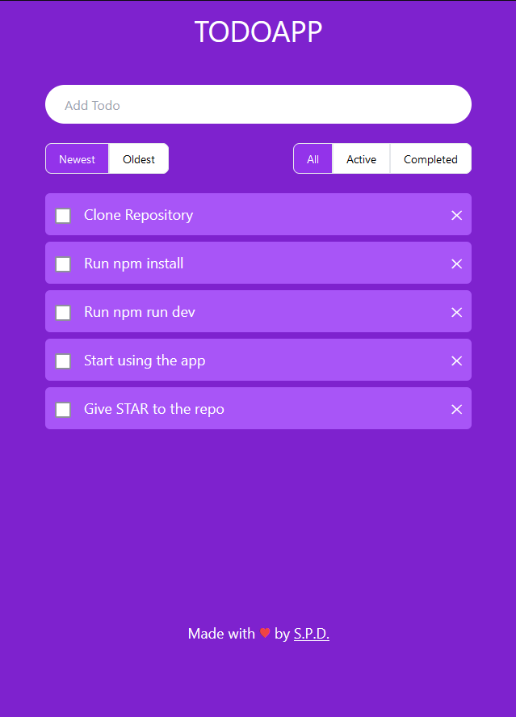

# Todo App

Simple Todo App made with reactjs and jotai for state management.

Prerequisites:
- Node

Clone the repository.
Run below command to install dependencies and run app.

```
cd todoapp
npm install
npm run dev
```

### Screenshots



